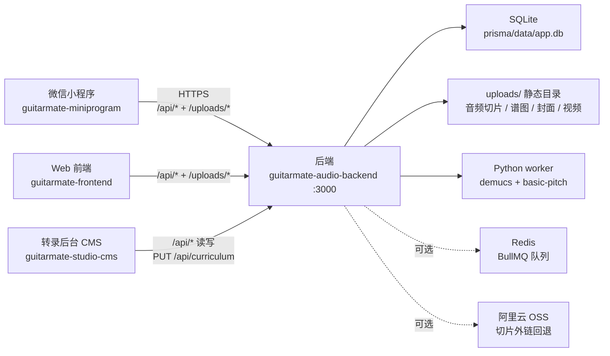
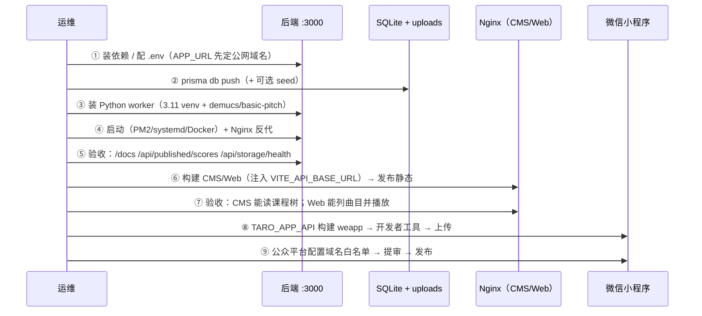

# GuitarMate 全栈部署文档

> 覆盖 4 个子项目的**完整部署流程**：后端服务、转录管理后台（CMS）、微信小程序、Web 前端。
> 所有命令、路径、环境变量、默认值都**对照当前仓库代码**核对过（不是凭印象写的），
> 关键处的「坑」都标注了 ⚠️ 并给出验证方法。

- 文档版本：2026-09-27
- 适用仓库：`d:\djc\guitar`（monorepo，4 个独立项目）

---

## 0. 总览

### 0.1 四个项目一览

| # | 项目 | 技术栈 | 产物 | 运行形态 | 对外端口 |
|---|---|---|---|---|---|
| 1 | `guitarmate-audio-backend` | NestJS 12 + Prisma 5 + SQLite + Python worker | `dist/`（Node 服务） | 常驻服务（PM2 / systemd / Docker） | **3000**（`main.ts` 硬编码） |
| 2 | `guitarmate-studio-cms` | React 19 + Vite 8 + Tailwind 4 | `dist/`（**纯静态**） | 静态托管（Nginx） | 生产任意端口/域名；**开发建议 5199** |
| 3 | `guitarmate-miniprogram` | Taro 4.2 + React 18 + webpack5 | `dist/`（小程序代码包） | 微信开发者工具 → 上传 → 审核发布 | 无（跑在微信里） |
| 4 | `guitarmate-frontend` | React 19 + Vite 6 + Tailwind 4 | `dist/`（**纯静态**） | 静态托管（Nginx） | 生产任意端口/域名；**开发建议 5198** |

### 0.2 依赖关系（谁连谁）



**结论：后端是所有前端唯一的运行时依赖**。另外三个都是"把静态产物扔出去"，没有自己的服务端。
所以部署顺序永远是：**先起后端 → 再发前端/CMS → 最后上传小程序**。

### 0.3 最小可用部署（只有一台机器，想最快跑起来）

```bash
# ① 后端
cd guitarmate-audio-backend
npm install
cp .env.example .env          # 按 §2.3 改 APP_URL / DATABASE_URL
npx prisma generate
npx prisma db push            # ⚠️ 本仓库没有 migrations/，用 db push（见 §2.4）
npm run build && npm start    # → http://<host>:3000/docs

# ② CMS（静态）
cd ../guitarmate-studio-cms
npm install
echo 'VITE_API_BASE_URL=https://api.example.com' > .env.production
npm run build                 # dist/ → 丢给 Nginx

# ③ Web 前端（静态）
cd ../guitarmate-frontend
npm install
echo 'VITE_API_BASE_URL=https://api.example.com' > .env.production
npm run build                 # dist/ → 丢给 Nginx

# ④ 小程序
cd ../guitarmate-miniprogram
npm install
TARO_APP_API=https://api.example.com npm run build:weapp   # dist/ → 微信开发者工具上传
```

---

## 1. 环境准备

### 1.1 版本矩阵（对应当前代码）

| 组件 | 要求 | 依据 | 本机实测 |
|---|---|---|---|
| Node.js | **`^20.19.0 \|\| >=22.12.0`**（CMS 的 `vite@8` 在 package.json 里写明的 `engines`；后端同理） | `guitarmate-studio-cms/node_modules/vite/package.json#engines` | `v24.21.0` ✅ |
| npm | 10+ | | `11.19.0` ✅ |
| Python | **3.11**（装 `basic-pitch` 时**必须 ≤3.11**） | `workers/requirements.txt` 注释：`basic-pitch` 依赖 `tensorflow<2.15.1`，TF 2.15 只出到 cp311 wheel | 系统 `3.8.6`（太旧）→ 用专用 venv `3.11.9` ✅ |
| ffmpeg **与** ffprobe | 二选一：`apt install ffmpeg`（自带 ffprobe）或使用 npm 的 `ffmpeg-static` + `ffprobe-static` | `workers/requirements.txt`：demucs 读音频会分别 spawn `ffprobe` 和 `ffmpeg` | Windows 用 npm 包 ✅ |
| Docker | 可选（本机未装也能跑） | `Dockerfile` + `docker-compose.yml` 已备好 | 未安装 |
| 微信开发者工具 | 发布小程序必需 | `project.config.json`（`miniprogramRoot: dist/`） | — |

### 1.2 端口占用表（避免自相残杀）

| 端口 | 谁 | 说明 |
|---|---|---|
| 3000 | 后端 | ⚠️ **`main.ts` 里 `const port = 3000` 是硬编码的**，`.env` 的 `PORT=3000` 实际不生效 |
| 5199 | CMS 开发服务器（**本项目约定**） | ⚠️ CMS `package.json` 里的 `dev` 脚本写的是 `vite --port=3000`，**会和后端撞车**，所以团队一直用 `npx vite --port 5199 --strictPort` |
| 5198 | Web 前端开发服务器（**本项目约定**） | 同上（脚本里也是 3000） |
| 5299 | 小程序 H5 预览（可选） | `node scripts/serve-h5.mjs dist-h5 5299` |
| 6379 | Redis（可选） | 只有 `QUEUE_DRIVER=bullmq` 时才需要 |

### 1.3 生产环境建议的目录规划

```
/opt/guitarmate/
├── backend/                    # git clone 的 guitarmate-audio-backend
│   ├── .env                    # ⚠️ 不进 git（.gitignore 已忽略 .env*）
│   ├── cookies.txt             # ⚠️ yt-dlp 凭证，不进 git / 不进镜像
│   ├── prisma/data/app.db      # ⚠️ 真正的 SQLite 文件（见 §2.4 的坑）
│   └── uploads/                # 所有音频/谱图/封面/视频
├── cms-dist/                   # CMS 的 dist/ 产物
├── web-dist/                   # Web 前端的 dist/ 产物
└── backups/                    # DB + uploads 的备份
```

---

## 2. Part 1：后端部署 `guitarmate-audio-backend`

后端 = **NestJS HTTP 服务 + SQLite + 本地静态资源目录 + Python AI worker（可选）**。
它同时是 CMS 与小程序的数据源，**必须先起**。

### 2.1 安装依赖

```bash
cd guitarmate-audio-backend
npm install
```

### 2.2 初始化数据库（Prisma）

```bash
npx prisma generate          # 生成 @prisma/client
npx prisma db push           # 建表（本项目没有 migrations/，见下）
npm run db:seed              # 可选：写入示例曲目（prisma/seed.ts）
```

> ⚠️ **为什么是 `db push` 而不是 `migrate deploy`**：
> 仓库里**没有 `prisma/migrations/` 目录**。自己验一下（实测输出）：
>
> ```text
> $ npx prisma migrate status
> Datasource "db": SQLite database "app.db" at "file:./data/app.db"
> No migration found in prisma/migrations
> The current database is not managed by Prisma Migrate.
> ```
>
> 所以线上只有两条路：
> 1. 直接用 `prisma db push`（最快，适合单机 SQLite；`Dockerfile` 的 CMD 就是这么做的）；
> 2. 想规范化：先在**开发机**执行 `npm run prisma:migrate`（`prisma migrate dev --name init`）生成迁移文件，
>    提交 `prisma/migrations/` 后，线上改用 `npx prisma migrate deploy`。
>
> 课程大纲（`CurriculumDoc`）**首次访问会自动落库种子**（`prisma/curriculum.seed.json`），不需要手动导入。

### 2.3 环境变量（`.env`）

以后端根目录的 `.env` 为准（`main.ts` 第一行 `import 'dotenv/config'`）。
`dotenv` **不会**注入到 Python worker，worker 的 PATH/环境由后端自己控制（见 §2.6）。

#### 必填 / 强烈建议

| 变量 | 默认 | 说明 |
|---|---|---|
| `APP_URL` | `http://localhost:3000` | ⚠️⚠️ **最容易被漏、后果最严重**：所有"绝对地址"都从这里拼（`uploads/**` 音频、课程封面/视频、示范音频、PracticePackage 里的音频 URL）。生产必须写**公网 HTTPS 地址**，否则小程序/前端会拿到 `http://localhost:3000/...` 而全线加载失败 |
| `DATABASE_URL` | `file:./data/app.db` | SQLite 路径，**相对路径按 `prisma/` 目录解析**（见 §2.4） |
| `OSS_REGION` / `OSS_BUCKET` / `OSS_ACCESS_KEY_ID` / `OSS_ACCESS_KEY_SECRET` | 空 | 阿里云 OSS。**留空 = 自动降级为本地 `uploads/` 静态目录**（本地/单机部署完全可以留空） |

#### 转录流水线（Python worker）

| 变量 | 默认 | 说明 |
|---|---|---|
| `PYTHON_BIN` | 自动探测 | **指定装好 demucs/basic-pitch 的 Python 解释器**。⚠️ 本机系统 Python 是 3.8.6 → 必须指向 3.11 的 venv（实测：`C:\Users\HP\AppData\Local\GuitarMate\ai-venv\Scripts\python.exe`） |
| `WORKERS_DIR` | `<cwd>/workers` | Python 脚本目录（容器里是 `/app/workers`） |
| `WORKER_TIMEOUT_MS` | `1800000`（30 分钟） | 单个 worker 阶段超时 |
| `TRANSCRIBE_SIMULATE` | 自动探测 | **生产必须显式设 `false`**：缺 demucs/basic-pitch 时**直接失败**，而不是悄悄退化成"模拟转录"（历史上正是这样让"节点不准"被忽视很久） |
| `DEMUCS_MODEL` | `htdemucs_6s` | 6 轨分离模型（drums/bass/other/vocals/guitar/piano） |
| `TAYUYA_BIN` | 自动探测 | 外部 tayuya 可执行文件（默认走仓库内 `workers/midi_to_tab.py`，纯标准库，无需装） |
| `BASIC_PITCH_ONSET` / `BASIC_PITCH_FRAME` / `BASIC_PITCH_MIN_NOTE_MS` | `0.5` / `0.45` / `100` | 转录灵敏度；调高更保守（少音/更干净） |
| `TAB_QUANTIZE_GRID` | `1/16` | 谱面量化网格 |

#### 队列（可选）

| 变量 | 默认 | 说明 |
|---|---|---|
| `QUEUE_DRIVER` | `auto` | `bullmq`（需 Redis）\| `in-process`（进程内 FIFO，重启丢队列）\| `auto`（连得上 Redis 就用 BullMQ） |
| `REDIS_URL` | `redis://127.0.0.1:6379` | 仅 BullMQ 使用 |
| `TRANSCRIBE_QUEUE_NAME` | `transcription` | 队列名 |
| `TRANSCRIBE_CONCURRENCY` | `1` | ⚠️ **默认 1 是有意的**：Demucs 吃满 CPU，并发 >1 会把机器打死 |
| `TRANSCRIBE_JOB_ATTEMPTS` | `2` | 单阶段最大尝试次数 |

#### URL 导入 / yt-dlp

| 变量 | 默认 | 说明 |
|---|---|---|
| `YTDLP_BIN` | 自动探测（PATH 上的 `yt-dlp` 或 `python -m yt_dlp`） | 可执行文件路径 |
| `YTDLP_COOKIES` | 自动识别根目录 `cookies.txt` | ⚠️ **等同账号凭证**：`.gitignore` + `.dockerignore` 都已排除，**线上要挂载进去，绝不进镜像** |
| `YTDLP_COOKIES_FROM_BROWSER` | 空 | 例如 `firefox`（Chrome/Edge 127+ 因 App-Bound 加密通常失败） |
| `YTDLP_JS_RUNTIME` | 自动探测 node/deno/bun | 解 YouTube JS 挑战；缺它表现为 `Video unavailable` |
| `YTDLP_REMOTE_COMPONENTS` | `ejs:github` | 无外网时设 `off` |
| `YTDLP_EXTRA_ARGS` | 空 | 透传参数，如 `--extractor-args youtube:player_client=web_safari` |
| `YTDLP_TIMEOUT_MS` | `900000`（15 分钟） | 下载超时 |
| `HTTP_PROXY` / `HTTPS_PROXY` / `NO_PROXY` | 空 | 走代理拉 YouTube；`NO_PROXY` 会自动带上本地回环 |
| `TRANSCODE_TIMEOUT_MS` | `600000`（10 分钟） | 课程视频转码超时（`/api/curriculum/assets/transcode` 是**同步接口**） |

`.env` 示例（单机 + 本地 AI）：

```dotenv
APP_URL="https://api.example.com"
DATABASE_URL="file:./data/app.db"
PORT=3000
OSS_REGION="oss-cn-hangzhou"
OSS_BUCKET="guitar-practice"
OSS_ACCESS_KEY_ID=""
OSS_ACCESS_KEY_SECRET=""
PYTHON_BIN="C:\\Users\\HP\\AppData\\Local\\GuitarMate\\ai-venv\\Scripts\\python.exe"
TRANSCRIBE_SIMULATE=false
```

### 2.4 ⚠️ SQLite 路径的坑（**部署时最容易丢数据的地方**）

`prisma/schema.prisma` 里写的是 `url = "file:./data/app.db"`，而 **Prisma 的相对路径按 schema 所在目录解析**，
`prisma/` 目录下的 `data/` 才是真正的库。实测本仓库同时存在两个文件：

```powershell
PS> Get-ChildItem -Recurse -Filter *.db | Select FullName, Length, LastWriteTime
D:\djc\guitar\guitarmate-audio-backend\data\app.db           98,304 B   2026/9/19   # ← 陈旧，不是活的
D:\djc\guitar\guitarmate-audio-backend\prisma\data\app.db  3,604,480 B  2026/9/27   # ← 真正在用的
```

| 场景 | `DATABASE_URL` | 实际文件 |
|---|---|---|
| 本地开发（`.env` 里是相对路径） | `file:./data/app.db` | **`prisma/data/app.db`** |
| docker-compose（给了绝对路径） | `file:/app/data/app.db` | `/app/data/app.db`（= 宿主 `./data/app.db`） |

**所以：备份/迁移前先确认到底在用哪个文件**，最简单的办法是看 `mtime` 谁在变（上面那条命令），
或者直接查一个业务表确认能读到数据：

```bash
# 能读到行数，说明就是它在用（把 CurriculumDoc 换成任意业务表）
npx prisma db execute --file ./check.sql     # 文件里写: select count(*) from CurriculumDoc;
```

### 2.5 启动服务（三选一）

#### A. 直接跑（最简单，适合单机/内网）

```bash
npm run build
npm start                       # = node dist/main.js
# 或开发模式（watch，改了自动重启）
npm run dev
```

日志会打印：

```
🎸 GuitarMate Audio Backend is running!
📡 Server:      http://0.0.0.0:3000
📑 Swagger Docs: http://0.0.0.0:3000/docs
🗄️  Database:    SQLite (./data/app.db)
```

#### B. PM2（推荐：开机自启 + 崩溃拉起）

```bash
npm i -g pm2
pm2 start dist/main.js --name guitarmate-api --cwd /opt/guitarmate/backend
pm2 save && pm2 startup          # 按提示执行输出的那条命令，做开机自启
pm2 logs guitarmate-api
```

#### C. Docker / docker-compose

```bash
cd guitarmate-audio-backend
docker compose up -d --build
docker compose logs -f backend
```

`docker-compose.yml` 已挂载 `./data → /app/data`、`./uploads → /app/uploads`，
并在容器启动时执行 `prisma migrate deploy || true; prisma db push --skip-generate; node dist/main.js`。

**镜像的两个已知约束（`Dockerfile` 里都写了原因）**：

1. 必须是 **glibc（node:20-slim）**，不能用 alpine：PyTorch 没有 musl wheel，Prisma query engine 也与 libc 绑定；
2. `basic-pitch` **默认不装**（会让镜像 +600MB），要装用：
   `docker build --build-arg INSTALL_BASIC_PITCH=true .`（容器里 Debian 的 `python3` 正好是 3.11，满足 TF 的 wheel 约束）。

模型权重（demucs 会从 HuggingFace 拉 `htdemucs_6s` ≈300MB）通过 `VOLUME /app/models` 持久化，
环境变量 `TORCH_HOME=/app/models/torch`、`HF_HOME=/app/models/hf` 已设好 —— **别删这个卷，否则每次重启重下**。

### 2.6 Python AI worker 安装（要真实转录就必做）

后端会**自动探测** Python 与 worker 脚本；探测不到时按 `TRANSCRIBE_SIMULATE` 决定失败还是降级。

```bash
# ① 建 3.11 venv（⚠️ 3.12+ 装不上 basic-pitch）
python3.11 -m venv /opt/guitarmate/ai-venv

# ② 档位 A：完整真实转录（推荐生产）
/opt/guitarmate/ai-venv/bin/pip install -r workers/requirements.txt
#   → demucs + torch(CPU) + basic-pitch + pretty_midi + librosa + yt-dlp
# ③ basic-pitch 的两个硬约束（缺一个就运行时报错）
/opt/guitarmate/ai-venv/bin/pip install -U "setuptools<81"     # 它仍 import pkg_resources

# ④ 告诉后端用这个解释器
echo 'PYTHON_BIN=/opt/guitarmate/ai-venv/bin/python' >> .env
```

档位 B（只想跑通链路、不要复音转录）：只装 `torch` + `demucs`，缺 `basic-pitch` 时后端会走 Node 兜底模拟。

**ffmpeg/ffprobe**：Linux 用 `apt install ffmpeg`（自带 ffprobe）；Windows 上项目的 `ffmpeg-static` **只有 `ffmpeg.exe`**，
所以额外依赖 npm 包 `ffprobe-static`，由 `python-runner.service.ts#workerEnv()` 把两者目录塞进 worker 的 PATH。
少 ffprobe 的报错极具误导性：`读取音频失败（请确认是有效的 mp3/wav/flac）：[WinError 2] 系统找不到指定的文件`。

### 2.7 反向代理（Nginx 示例）

后端自身：`0.0.0.0:3000`，静态目录 `/uploads/`（`Cache-Control: max-age=7d, immutable`），CORS 全开（`origin: '*'`）。

```nginx
server {
  listen 443 ssl http2;
  server_name api.example.com;

  # ⚠️ 必须放开：后端 JSON body limit 是 30mb（课程视频/封面走 base64，膨胀 4/3）
  #    默认 1m 会让"上传视频/封面"直接 413
  client_max_body_size 32m;

  location /api/ {
    proxy_pass http://127.0.0.1:3000;
    proxy_set_header Host $host;
    proxy_set_header X-Real-IP $remote_addr;
    proxy_set_header X-Forwarded-Proto $scheme;
    proxy_read_timeout 900s;      # 转码/转录是长请求（TRANSCODE_TIMEOUT_MS 默认 10 分钟）
  }

  location /docs   { proxy_pass http://127.0.0.1:3000; proxy_set_header Host $host; }
  location /swagger{ proxy_pass http://127.0.0.1:3000; proxy_set_header Host $host; }

  # 音频/谱图/封面/视频：直出 + 长缓存（文件名带内容指纹/时间戳，内容不会变）
  location /uploads/ {
    proxy_pass http://127.0.0.1:3000;
    proxy_set_header Host $host;
    expires 7d;
    add_header Cache-Control "public, immutable";
  }
}
```

> 上线前想清楚：`APP_URL` 必须等于这个域名（`https://api.example.com`），否则上面所有绝对地址都错。

### 2.8 部署后验收（复制即用）

```bash
BASE=http://127.0.0.1:3000

curl -s $BASE/                                    # 服务活着
curl -s $BASE/api/published/scores | head -c 400   # C 端曲库（只有 published 的曲目会出）
curl -s $BASE/api/curriculum/learn | head -c 400   # 小程序课程投影（阶段/课程/章节/课时 + 视频绝对 URL）
curl -s $BASE/api/storage/health                   # 存储体检：孤儿文件 / 悬空引用 / 数据缺失
curl -s $BASE/api/curriculum/health                # 课程数据体检
curl -s $BASE/api/curriculum/assets | head -c 400  # 视频与封面资产库（含孤儿）
curl -s $BASE/api/transcription/capabilities       # ★ AI worker 装好了吗（python/demucs/basic-pitch/yt-dlp）
curl -s $BASE/api/transcription/queue              # ★ 队列 driver 与积压（缺 Redis 时应为 in-process）
```

**注意 `APP_URL` 的验收方式**：随便取一条音频 URL，确认它的域名是公网地址而不是 localhost：

```bash
curl -s $BASE/api/curriculum/learn | grep -o 'http[^"]*uploads[^"]*' | head -3
```

可选回归脚本（开发机/CI 用）：

```bash
npm run verify:alignment && npm run verify:package && npm run verify:meta
npm run verify:pitch
npm run tab:verify
npm run transcribe:verify        # 端到端转录流水线（需要 worker 装好）
```

### 2.9 备份与恢复

要备份的只有**两样东西**：

| 备份对象 | 路径 | 说明 |
|---|---|---|
| SQLite | **`prisma/data/app.db`**（本地）或 `data/app.db`（compose 挂载时） | 单文件，复制即完整备份 |
| 静态资源 | `uploads/` | 音频切片、谱图、课程封面/视频、转录 JSON；体积会到几百 MB |

```bash
# Linux
mkdir -p backups
cp prisma/data/app.db "backups/app-$(date +%Y%m%d-%H%M).db"
tar czf "backups/uploads-$(date +%Y%m%d).tgz" uploads/

# Windows PowerShell
Copy-Item prisma\data\app.db "backups\app-$(Get-Date -Format yyyyMMdd-HHmm).db"
Compress-Archive -Path uploads -DestinationPath "backups\uploads-$(Get-Date -Format yyyyMMdd).zip"
```

恢复：停服务 → 覆盖 DB 文件 + 解包 `uploads/` → 起服务。

> 磁盘被"孤儿文件"撑大时，用体检接口先看再清：
> `GET /api/storage/health` → `DELETE /api/storage/orphans?domain=transcriptions&dryRun=1` 演练 → 去掉 `dryRun` 真删。
> 课程域：`GET /api/curriculum/assets` → `DELETE /api/curriculum/assets?path=...`。
> **它们只删"没有任何记录引用"的文件**，被引用的会被 409 拦住。

---

## 3. Part 2：转录管理后台 CMS 部署 `guitarmate-studio-cms`

CMS = **纯前端静态站点**（React + Vite），通过浏览器直接调用后端 `/api/*`。**没有自己的服务端、没有登录体系**，
所以生产上要么放内网，要么在反向代理层加 Basic Auth / VPN。

### 3.1 构建

```bash
cd guitarmate-studio-cms
npm install

# ⚠️ 后端地址是**构建期**注入的（Vite 的 import.meta.env），改完必须重新 build
echo 'VITE_API_BASE_URL=https://api.example.com' > .env.production

npm run lint        # = tsc --noEmit（CI 建议加上）
npm run build       # 产物：dist/
```

验证构建产物里注入的地址正确：

```bash
grep -o 'https://api.example.com' dist/assets/*.js | head -1
```

### 3.2 本地/内网联调

```bash
# ⚠️ 不要用 npm run dev（脚本里是 --port=3000，会和后端撞车）
npx vite --port 5199 --strictPort
# → http://localhost:5199
```

默认后端地址是 `http://localhost:3000`（`src/services/api.ts` 的兜底值），本地不用配 `.env`。

### 3.3 Nginx 托管（静态 + SPA 回退）

```nginx
server {
  listen 443 ssl http2;
  server_name studio.example.com;

  root /opt/guitarmate/cms-dist;
  index index.html;

  # SPA 路由回退（CMS 是单页应用，刷新子路径不能 404）
  location / { try_files $uri $uri/ /index.html; }

  # 可选：它没有任何鉴权，公网部署强烈建议加一道门
  # auth_basic "GuitarMate Studio";
  # auth_basic_user_file /etc/nginx/.htpasswd;

  location ~* \.(js|css|woff2?|png|jpg|svg)$ {
    expires 30d; add_header Cache-Control "public, immutable";
  }
}
```

> 浏览器 → `https://api.example.com` 是**跨域**请求。后端 `main.ts` 已 `enableCors({ origin: '*' })`，
> 且**注册在静态目录之前**（否则 `/uploads/**` 会缺 `Access-Control-Allow-Origin`，音频波形提取会被浏览器拦，
> 而 `<audio src>` 播放却正常 —— 症状很隐蔽）。
> 想收紧成白名单，改这一处即可。

### 3.4 数据安全提醒

CMS 直接 `PUT /api/curriculum` 覆盖整棵课程树（带 `baseRevision` 乐观锁，冲突 409）。
多人同时开 CMS 时，后保存的人会被拦下并提示刷新 —— 这是预期行为，**不要绕过**。

---

## 4. Part 3：微信小程序部署 `guitarmate-miniprogram`

### 4.1 构建 weapp 产物

```bash
cd guitarmate-miniprogram
npm install

# ⚠️ 后端地址是**构建期**注入（Taro 的 process.env.TARO_APP_API），改完必须重新 build
TARO_APP_API=https://api.example.com npm run build:weapp
#   Windows PowerShell：
#   $env:TARO_APP_API="https://api.example.com"; npm run build:weapp
```

产物目录：**`dist/`**（`config/index.js` 里 `outputRoot: TARO_ENV === 'h5' ? 'dist-h5' : 'dist'`）。
⚠️ **不要**用 `npm run build:h5` 覆盖 `dist/` —— 那会得到一份网页产物，开发者工具打开会报一堆 WXML 语法错。

验证注入的地址：

```bash
grep -rl "api.example.com" dist | head -3
```

### 4.2 必要配置（首次部署）

1. `project.config.json`
   - `miniprogramRoot: "dist/"` ✅ 已配好（**所以开发者工具打开的必须是项目根目录，不是 `dist/`**）
   - `appid: "touristappid"` ⚠️ **改成你自己的小程序 AppID**（游客模式无法上传/发布）
   - `setting.urlCheck: false` ✅ 已配好 → **只对开发者工具生效**，让工具能访问 `http://localhost:3000`
2. 微信公众平台 → 开发 → 开发设置 → **服务器域名**（真机必需，见 §4.4）：
   - `request 合法域名`：后端 API 域名
   - `downloadFile 合法域名`：如果前端用 `Taro.downloadFile` 拉资源
   - `uploadFile 合法域名`：如果有上传
3. `metadata.json` / 其他 AI-Studio 脚手架文件与小程序运行无关，可忽略。

### 4.3 用微信开发者工具打开 / 上传

**手动**：微信开发者工具 → 导入项目 → 目录选 **`guitarmate-miniprogram/`（项目根）** → 填 AppID → 编译。

**命令行**（CI/脚本化）：

```powershell
# Windows；退出码 1 是正常的，看输出里有没有 √ open
& "C:\Program Files (x86)\Tencent\微信web开发者工具\cli.bat" open --project "d:\djc\guitar\guitarmate-miniprogram" --port 58399
```

上传体验版：

```powershell
& "...\cli.bat" upload --project "d:\djc\guitar\guitarmate-miniprogram" -v 1.0.0 -d "首次提审"
```

再回公众平台：**版本管理 → 提交审核 → 审核通过后发布**。

### 4.4 ⚠️ 真机 vs 开发者工具（最容易卡住的一步）

| 环境 | 能否访问 `http://localhost:3000` | 要求 |
|---|---|---|
| 开发者工具 | ✅（`urlCheck: false`） | 后端在本机 3000 跑着即可 |
| **真机预览 / 体验版 / 正式版** | ❌ | 必须 **HTTPS 域名** + 已加入**服务器域名白名单**；`http://` 和纯 IP 都不允许 |

所以真机联调的正确姿势是：先把后端部署到 `https://api.example.com`（§2.7），
再用 `TARO_APP_API=https://api.example.com` 重新构建。
临时内网穿透（ngrok/cpolar 等）也可以，但要把穿透域名加进白名单。

### 4.5 音频/视频播放的额外注意

- 课程视频、音频切片都是**后端 `/uploads/**` 直出**，所以 `APP_URL`（后端侧）与 `TARO_APP_API`（小程序侧）**必须指向同一个公网域名**，否则会出现"能打开页面但资源 404"。
- 小程序对**媒体域名**也有校验：音频/视频用的域名同样要在公众平台里加白名单（`request` 之外的媒体域名在部分基础库版本下会单独校验）。
- 大视频不要塞进小程序包体：包体上限 2MB（主包）/ 20MB（总），视频一律走 `/uploads/` 或 OSS/CDN。

### 4.6 可选：H5 预览（仅用于本地验收）

```bash
npm run build:h5                                   # → dist-h5/
node scripts/serve-h5.mjs dist-h5 5299             # → http://localhost:5299/index.html#/pages/index/index
```

⚠️ H5 只能验证结构/文案/坐标逻辑：**图片不渲染、麦克风与视频播放的行为与真机不同**，真机验收走 weapp。

---

## 5. Part 4：Web 前端部署 `guitarmate-frontend`

同样是**纯静态站点**（React + Vite 6）。

### 5.1 构建

```bash
cd guitarmate-frontend
npm install

echo 'VITE_API_BASE_URL=https://api.example.com' > .env.production   # 构建期注入
npm run lint                                                          # tsc --noEmit
npm run build                                                         # → dist/
```

### 5.2 本地联调

```bash
# 同样避开脚本里的 3000 端口
npx vite --port 5198 --strictPort
```

### 5.3 Nginx 托管

```nginx
server {
  listen 443 ssl http2;
  server_name app.example.com;

  root /opt/guitarmate/web-dist;
  index index.html;

  location / { try_files $uri $uri/ /index.html; }

  location ~* \.(js|css|woff2?|png|jpg|svg)$ {
    expires 30d; add_header Cache-Control "public, immutable";
  }
}
```

### 5.4 部署后验收

```bash
npm run verify:contract      # 与后端 PracticePackage 契约一致性（可在 CI 跑）
```

浏览器打开站点 → 曲库能列曲目 → 进入某小节能播放 → 六线谱高亮随播放游标移动。

---

## 6. 全流程部署顺序与验收清单



### 6.1 逐项打勾清单

- [ ] 后端 `GET /` 有响应，`/docs` 能打开 Swagger
- [ ] `APP_URL` = 公网域名；`curl .../api/curriculum/learn` 里的 `http...uploads...` 域名正确
- [ ] `prisma/data/app.db` 与 `uploads/` 都被纳入备份脚本
- [ ] `POST /api/curriculum/assets/video` 能成功（验证 Nginx `client_max_body_size` ≥32m）
- [ ] 转码接口能出产物（`/api/curriculum/assets/transcode`，机器要有 CPU 余量）
- [ ] 转录流水线能真正跑（`TRANSCRIBE_SIMULATE=false` 时不报"缺 demucs/basic-pitch"）- [ ] `curl /api/transcription/capabilities` 显示 demucs / basic-pitch / yt-dlp 均为可用（不是 `false`）
- [ ] `curl /api/transcription/queue` 返回正常（有 Redis 是 `bullmq`，没有也能降级为 `in-process`）- [ ] `GET /api/storage/health`、`/api/curriculum/health` 无 `error` 级问题
- [ ] CMS 站点能打开、能读课程树、保存时提示"已同步到后端（revision N）"
- [ ] Web 前端能列曲目、能播放、谱面高亮跟随
- [ ] 小程序真机（不是工具）能列出课程/曲目、能播放音频/视频
- [ ] `cookies.txt`、`.env`、OSS Key 都不在 git 与镜像里

---

## 7. 常见故障排查

| 现象 | 根因 | 处置 |
|---|---|---|
| 前端/小程序所有资源 404，URL 里是 `localhost:3000` | `APP_URL` 没改成公网域名 | 改 `.env` 的 `APP_URL` → **重启后端**（URL 是运行时拼的） |
| CMS/前端页面打开了，但接口全失败 | 构建时没注入 `VITE_API_BASE_URL` | 加 `.env.production` 后**重新 build**（Vite 变量是构建期注入） |
| 小程序真机拉不到数据，工具里正常 | 真机要求 HTTPS + 域名白名单 | 部署 HTTPS 后端 → 加白名单 → 用 `TARO_APP_API` 重建 |
| 上传封面/视频 413 | Nginx 默认 `client_max_body_size 1m` | 调到 `32m`（后端 limit 是 30mb） |
| `database file does not exist` / 表不存在 | 没建表 | `npx prisma db push` |
| 数据"不见了"（写入后重启复原） | 备份/挂载的是 `data/app.db`，而活的是 `prisma/data/app.db` | 见 §2.4，先确认哪个是活的 |
| 转码/转录请求超时（502/504） | Nginx 默认 `proxy_read_timeout 60s` | 调到 900s；并确认后端 `TRANSCODE_TIMEOUT_MS` / `WORKER_TIMEOUT_MS` |
| 转录报"读取音频失败…系统找不到指定的文件" | worker 缺 `ffprobe` | Linux `apt install ffmpeg`；Windows 依赖 `ffprobe-static`（已在依赖里） |
| 装 `basic-pitch` 失败 / 运行报 `pkg_resources` | Python 版本或 setuptools 太新 | 用 Python **3.11** venv + `pip install -U "setuptools<81"` |
| 转录"成功"但结果很差/节点不准 | 缺依赖时走了模拟转录 | 显式 `TRANSCRIBE_SIMULATE=false` 让缺失直接失败 |
| 转录任务一动不动 | 队列卡住 / Redis 挂了 | `GET /api/transcription/queue` 看各阶段积压与 driver；应急 `QUEUE_DRIVER=in-process` 重启 |
| `database is locked` | SQLite 单写者被并发写 | 单进程部署；必要时 `DATABASE_URL` 追加 `?connection_limit=1` |
| CMS 保存提示 409 | 别处已改过课程树（乐观锁） | 刷新页面重新编辑（这是保护，不是 bug） |
| 二进制/大文件上传失败 | 请求体超限 | 后端 30mb + Nginx 32m；更大的视频请放 OSS/CDN 后填 URL |
| 端口被占 | CMS/前端的 `dev` 脚本默认 3000，与后端冲突 | 用 `npx vite --port 5199` / `5198` |

---

## 8. 附录

### 8.1 端口与地址速查

| 用途 | 地址 |
|---|---|
| 后端 API | `http://<host>:3000/api/**` |
| Swagger 文档 | `http://<host>:3000/docs`（或 `/swagger`） |
| 静态资源 | `http://<host>:3000/uploads/**` |
| CMS 开发 | `http://localhost:5199` |
| Web 前端开发 | `http://localhost:5198` |
| 小程序 H5 预览 | `http://localhost:5299` |

### 8.2 关键接口（部署验收用）

| 接口 | 用途 |
|---|---|
| `GET /api/published/scores` \| `/api/published/library` | C 端曲库（只出 published） |
| `GET /api/published/items/:id/package` | PracticePackage 契约快照（小程序唯一数据契约） |
| `GET /api/curriculum/learn` | 小程序课程投影（含视频绝对 URL 与打点） |
| `GET /api/curriculum/health` | 课程数据体检（悬空引用/孤儿） |
| `GET /api/storage/health` | 存储体检（转录/切片/导入工程/缓存目录） |
| `DELETE /api/storage/orphans?domain=&dryRun=1` | 孤儿文件清理（先演练） |
| `POST /api/curriculum/assets/{cover,video,transcode}` | 封面/视频上传与转码 |
| `GET /api/curriculum/assets` | 视频与封面资产库（含悬空引用） |
| `GET /api/transcription/queue` | 转录队列与各阶段积压（driver: bullmq / in-process） |
| `GET /api/transcription/capabilities` | 环境能力探测（Python / demucs / basic-pitch / yt-dlp 是否可用） |

### 8.3 npm scripts 速查

**后端**

| 脚本 | 作用 |
|---|---|
| `npm run dev` / `build` / `start` | 开发 watch / 编译 / 跑 `dist/main.js` |
| `npm run lint` | `tsc --noEmit` |
| `prisma:generate` / `prisma:migrate` / `db:seed` / `prisma:studio` | Prisma 相关 |
| `demo:audio` / `demo:original` / `demo:solo` | 生成示范音频（发布小节的音频回退方案） |
| `verify:alignment` / `verify:package` / `verify:meta` / `verify:pitch` | 数据/契约回归 |
| `tab:import` / `tab:verify` | 六线谱导入 |
| `transcribe:verify` / `e2e:full` | 端到端流水线验证 |
| `youtube:login` / `youtube:cookies` / `youtube:check` | yt-dlp cookies 与连通性 |
| `agent` / `agent:e2e` | 本机下载代理（客户端驱动 URL 下载时用） |

**CMS**：`dev` / `build` / `preview` / `lint` / `verify:curriculum` / `verify:tab-layout`
**Web 前端**：`dev` / `build` / `preview` / `lint` / `verify:contract` / `audit:audio`
**小程序**：`build:weapp` / `dev:weapp` / `build:h5` / `dev:h5`

> 小程序仓库里还有两个可选的本地校验脚本（`scripts/`）：
> `serve-h5.mjs`（起 H5 静态服务）与 `verify-play-along.ts`（跟弹评分回归，用 CMS 的 tsx 跑：
> `node ..\guitarmate-studio-cms\node_modules\tsx\dist\cli.mjs scripts\verify-play-along.ts`）。

### 8.4 安全清单（上线前必看）

1. **CMS 与后端没有账号体系**：CMS 放内网或加 Basic Auth/VPN；Swagger `/docs` 公网务必关掉或加鉴权。
2. **CORS 现在是 `origin: '*'`**：收紧成前端域名白名单。
3. **`cookies.txt` 等同 YouTube 账号凭证**：只在服务器上放/挂载，`.gitignore`/`.dockerignore` 已排除，**别提交、别进镜像**。
4. **`.env` 不入库**（含 OSS Key / DB / 代理）；生产用环境变量或密钥管理注入。
5. **`uploads/` 是公开目录**：任何上传过的文件都可被匿名访问。敏感素材不要走直传。
6. **SQLite 文件权限**：`prisma/data/app.db` 仅服务账号可读写；备份文件同样。
7. **转码/转录是 CPU 密集型**：`TRANSCRIBE_CONCURRENCY` 保持 1，给机器留余量，避免接口整体变慢。
8. **静态站点缓存**：`index.html` 不要长缓存（否则发版后用户拿到旧壳），资源文件按 hash 长缓存。

### 8.5 相关文档

| 文档 | 内容 |
|---|---|
| `guitarmate-audio-backend/README.md` | 后端快速开始、接口、Docker、备份、FAQ |
| `TRANSCRIPTION_PIPELINE.md` | 音频转录流水线（demucs → basic-pitch → tayuya → PracticePackage） |
| `TAB_IMPORT_PIPELINE.md` | 六线谱导入链路（gpx/musicxml/ascii/chord-sheet/transcription） |
| `guitarMate.md` | 产品与架构总览 |

---

**部署完成后最小验收（30 秒）**

```bash
curl -s http://<host>:3000/ >/dev/null && echo "backend OK"
curl -s http://<host>:3000/api/curriculum/learn | grep -q uploads && echo "APP_URL 已注入公网域名"
curl -s http://<host>:3000/api/storage/health | grep -q '"orphanFiles"' && echo "体检接口可用"
```

三条都通过，再去看 CMS、Web 前端与小程序真机。
